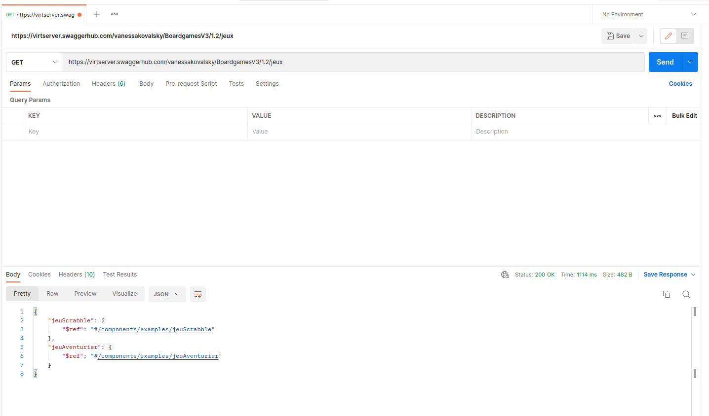
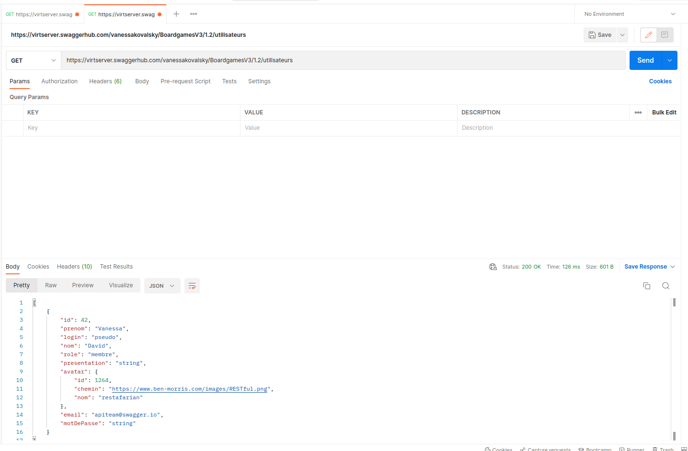
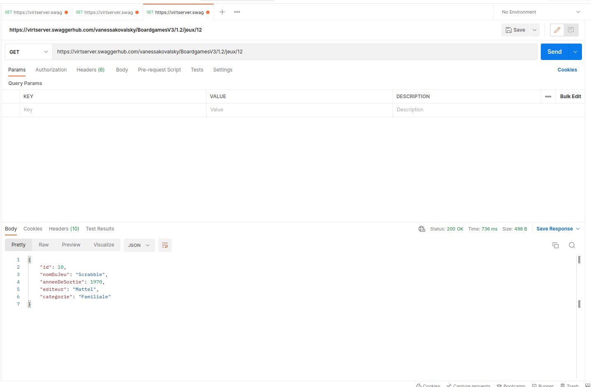
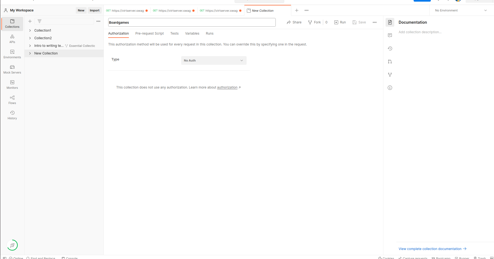
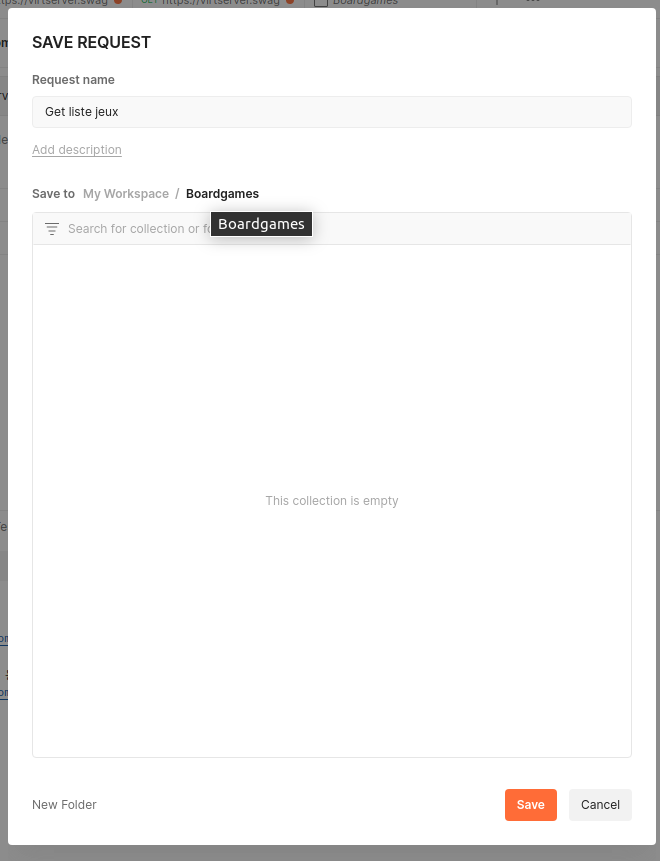
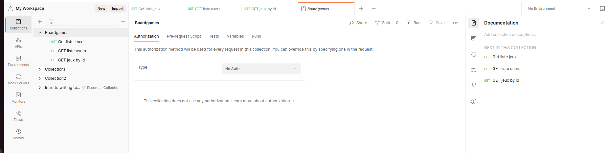

# Exercice 1 - Premières requêtes avec Postman

## Objectifs 

Cet exercice a pour objectifs : 
- de prendre en main postman
- de faire ses premières requêtes
- de gérer les paramètres à envoyer à nos requêtes
- de savoir enregistrer ses requêtes

## Pré-requis

* Installer Postman sur son poste : https://www.postman.com/downloads/
* Créer un compte sur postman.com 

## Présentation de l'API que nous allons utiliser 

* L'Api que nous allons utiliser est documenter dans Swagger : https://app.swaggerhub.com/apis/vanessakovalsky/BoardgamesV3/1.2
* Elle contient différents objets et données d'exemple qui nous permettront de faire des requêtes sans avoir besoin d'API spécifique, ou de serveur

## Ecrire sa première requête

* Dans postman, créer une nouvelle requête et appeler l'URL : https://virtserver.swaggerhub.com/vanessakovalsky/BoardgamesV3/1.2/jeux 
* Pour cela on utilise la méthode GET et l'url fournie ci-dessus, aucun paramètre n'est nécessaire
* On obtient alors une liste de jeux 

* Vous pouvez alors executer une nouvelle requête pour obtenir une liste des utilisateurs sur l'URL : https://virtserver.swaggerhub.com/vanessakovalsky/BoardgamesV3/1.2/utilisateurs

## Utiliser les paramètres de requêtes

* On va maintenant aller récupérer un jeu spécifique à partir de son ID.
* Pour cela créer une nouvelle requête identique à celle pour la liste des jeux, et ajouter dans l'url, parmi la liste des identifiants disponibles dans la liste des jeux que vous avez obtenu à l'étape précédente 

## Enregistrer ses requêtes dans une collection

* Afin de sauvegarder nos requêtes nous allons créer une collection
* Pour cela dans le menu collection cliquer sur `+`
* Donner un nom à votre collection, dans l'exemple : `Boardgames`

* Une fois la collection créé, revenir sur le premier onglet de notre première requête
* Cliquer sur `Save` pour enregistrer la requête, donner lui un nom, puis selectionner la collection que vous avez créé

* Faites de mêmes pour les deux autres requêtes que nous avons executées.
* Vous pouvez maintenant retrouver vos requêtes dans votre collections

-> Félicitations vous savez maintenant créer des requêtes et les exécuter, et sauvegarder vos requête dans une collection

## Pour aller plus loin

* Sur une API que vous connaissez et utiliser, créer une collection avec quelques requêtes qui permettent de récupérer des informations avec GET, en passant si nécessaire des paramètres à ses requêtes.