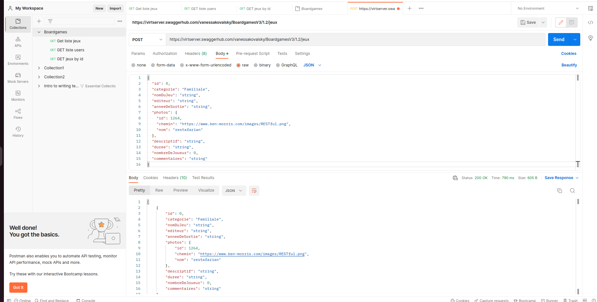
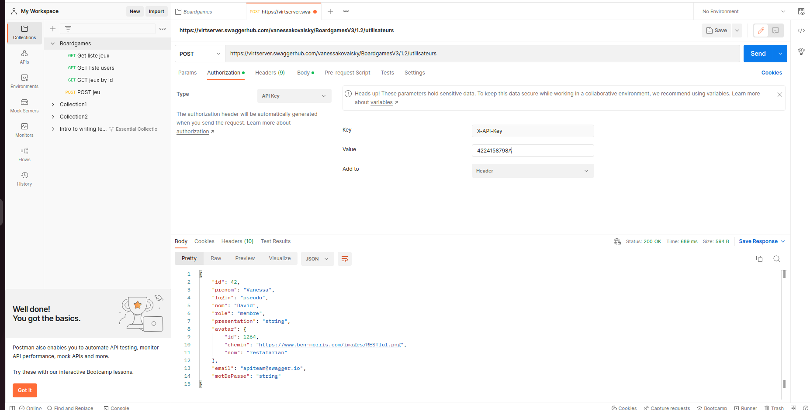

# Exercice 2 - envoyer des données et se connecter 


## Objectifs

Cet exercice a pour objectifs :
- d'etre capable d'envoyer des données
- d'être capable de se connecter pour effectuer des requêtes avec un token

## Pré-requis

- avoir effectué l'exercice 1 

## Envoyer des données


* Vous pouvez créer un nouveau jeux avec une requête de type POST
* Pour cela créer une nouvelle requête de type POST sur l'URL : https://virtserver.swaggerhub.com/vanessakovalsky/BoardgamesV3/1.2/jeux
* Dans Body, choisir Raw, puis le format JSON et copier ce contenu : 
```json
{
  "id": 0,
  "categorie": "Familiale",
  "nomDuJeu": "string",
  "editeur": "string",
  "anneeDeSortie": "string",
  "photos": {
    "id": 1264,
    "chemin": "https://www.ben-morris.com/images/RESTful.png",
    "nom": "restafarian"
  },
  "descriptif": "string",
  "duree": "string",
  "nombreDeJoueur": 0,
  "commentaires": "string"
}
```
* Vous pouvez envoyer la requête et observer le résultat



* Vous pouvez enregistrer la requête

## Se connecter à une API 

* Il est parfois nécessaire de s'authentifier pour pouvoir faire nos requêtes
* Ici nous allons utiliser une clé d'API qui nous a été transmise. Elle doit être ajouté dans le header pour pouvoir ajouter un un utilisateur.
* Créer une requête de type POST sur l'URL https://virtserver.swaggerhub.com/vanessakovalsky/BoardgamesV3/1.2/utilisateurs
* Dans Body, choisir Raw puis le format JSON et mettre le contenu suivant :
```json
{
  "id": 42,
  "prenom": "Vanessa",
  "login": "pseudo",
  "nom": "David",
  "role": "membre",
  "presentation": "string",
  "avatar": {
    "id": 1264,
    "chemin": "https://www.ben-morris.com/images/RESTful.png",
    "nom": "restafarian"
  },
  "email": "user@example.com",
  "motDePasse": "string"
}
```
* Puis nous devons ajouter la clé d'API dans les entêtes, pour cela aller dans l'onglet Authorization de la requête, choisir le type API Key, puis renseigner les valeurs suivantes :
    * key: X-API-Key
    * value: 4224158798A
    * Add to : Headers (par défaut)

* Ensuite vous pourrez exécuter la requête qui nécessitait une clé d'API



* D'autre fois il faudra se connecter afin d'obtenir un jeton d'authentification, que l'on devra utiliser pour effectuer certains appels à nos API
* Pour cela on fait une requête de type POST avec les informations de connexion sur l'adresse de connexion, la réponse contient alors un jeton d'authentification, qu'il faut copier, et qu'il faudra ajouter dans Authorization (le type dépend du mode d'authentification choisi de l'API). 


-> Félicitations vous savez maintenant envoyer des données et vous authentifier pour faire vos requêtes

## Pour aller plus loin
* Sur votre propre API, quel est le type d'authentification mis en en place?
* Essayer d'ajouter l'authorization avec les informations nécessaires pour effectuer une requête qui a besoin d'authentification.