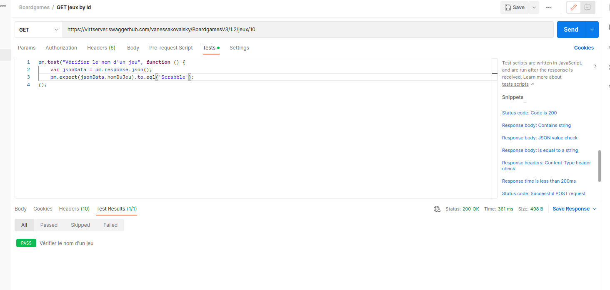

# Exercice 3 - écrire des scripts de tests et rendre variables nos requêtes


## Objectifs

Cet exercice a pour objectifs :
* d'apprendre à écrire un test dans Postman pour tester une API
* de découvrir l'utilisation des variables dans une collection
* d'utiliser les environnements de Postman

## Pré-requis

* Avoir réalisé les exercices 1 et 2

## Écrire son premier script de tests

* Nous allons ajouter différents tests : 
    * Vérifier le statut de la réponse d'un test
    * Vérifier une valeur renvoyée par une requête
    * Vérifier l'enregistrement d'un jeu

* Pour cela ouvrir la requête qui permet d'obtenir la liste des jeux puis aller dans l'onglet `Tests`
* Copier et coller dans la zone de saisie le test suivant :
```
pm.test('Status code is 200', function () {
    pm.response.to.have.status(200);
});
```
* Ce premier test permet de vérifier que le status de la réponse est bien 200, soit une réponse correcte
* On peut visualiser le résultat du tests, dans la partie basse de l'écran qui contient la réponse, sur l'onglet `Tests results`


* Nous allons ensuite faire un test sur la requête pour récupérer la fiche d'un jeu, pour vérifie que le nom du jeu et correct.
* Ouvrir la requête pour récupérer un jeu, et utiliser l'ID 10
* Dans l'onglet test, copier le test suivant :
```
pm.test("Vérifier le nom d'un jeu", function () {
    var jsonData = pm.response.json();
    pm.expect(jsonData.nomDuJeu).to.eql('Scrabble');
});
```
* Vérifier dans l'onglet tests si le test est passé



* Vous pouvez modifier le nom du jeu dans le test pour faire échouer le test :


* Pour l'enregistremet, nous allons utiliser la requête POST que nous avions enregistrer, et vérifier dans la réponse si les éléments renvoyés correspondent bien à ceux que nous avons saisir. La syntaxe étant identique au test précédent, à vous d'écrire complètement ce test.

* La syntaxe utilisé est du JavaScript, de nombreux exemples sont disponibles dans la documentation de Postman : https://learning.postman.com/docs/writing-scripts/script-references/test-examples/ 

## Rendre nos tests et nos requêtes variables 

### Utiliser les environnements

* Nous allons commencer par créer un environnement pour nos requêtes, en effet celle-ci peuvent être exécutée dans différents environnements (local, dev, test, prod...) et certaines informations seront spécifique à notre environnement
* Aller dans le menu environnement, puis cliquer sur `New`
* Vous pouvez alors choisir `Environment`


* Ensuite vous arrivez sur la page de votre environnement, vous pouvez lui donner un nom (ici Test) et définir des variables. 
* Nous avons définis 2 variables: 
    * base_url : https://virtserver.swaggerhub.com/vanessakovalsky/BoardgamesV3
    * version : 1.2 


* Une fois l'environnement enregistré en cliquant sur le bouton `Save` en haut à droite, nous allons retourner modifier nos requêtes pour utiliser nos variables
* Par exemple sur la liste des jeux l'URL devient : {{base_url}}/{{version}}/jeux 
* Avant d'exécuter la requête, il faut sélectionner notre environnement `test` dans la liste des environnements au dessus du bouton `Send`


* Remplacer maintenant l'url dans toutes nos requêtes avec les variables correspondantes

### Utiliser les variables de collections

* Nous allons définir une variable de collection pour notre identifiant de jeu
* Pour cela, ouvrir la collection en modification, puis aller sur l'onglet `Variables`
* Ajouter une variable avec id_jeu comme nom et une valeur à 10 


* Ensuite nous pouvons l'utiliser de la même manière que les variables d'environnement avec son nom entre double accolade : {{nom_de_ma_variable}}
* Par exemple sur la requête qui permet d'obtenir des informations sur un jeu avec son ID :


* Cet ID est il utile ailleurs ? Si oui utiliser la variable plutôt que la valeur en dure.

## Pour aller plus loin

* Sur votre propre collection, écrire un ou plusieurs tests pour chacune de vos requêtes
* Vous pouvez également définir des variables de collections et/ou un ou plusieurs environnement pour votre collection.