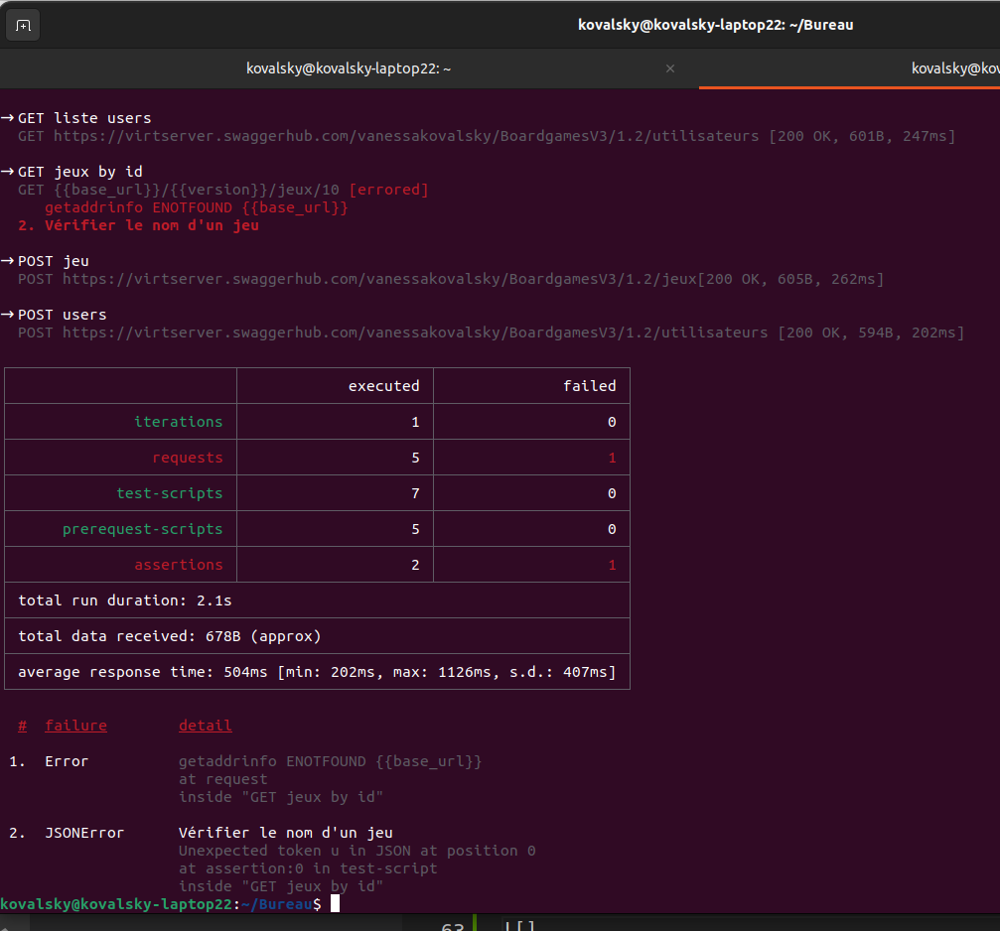

# Exercice 4 - automatiser les tests

## Objectifs

Cet exercice a pour objectifs : 
* de lancer les tests d'une collections avec le Runner
* d'automatiser leur lancement avec Newman en ligne de commande
* d'intégrer l'automatisation des tests à une chaîne d'intégration continue Gitlab CI

## Pré-requis

* Avoir réalisé les exercices précédents

## Exécuter ses test avec le Collection Runner

* Pour lancer le Runner, sélectionner l’icône du Runner en bas à droite de Postman
* Puis faite glisser votre collection


* Vous pouvez alors réordonner vos requêtes, ne selectionner que certaines requêtes et lancer l'exécution du run
* Vous obtenez alors le résultat pour chaque tests de vos requêtes, le temps d'exécution total et de nombreuses informations sur l’exécution de vos requêtes


* Ce Runner permet d'exécuter plusieurs tests les uns à la suite des autres, et d'exporter les résultats en JSON. 
* L'exécution des runs est enregistrés et cela permet de conserver un historique de l'évolution des exécutions de tests sur une collection.

## Fournir un fichier de données

* Il est possible de faire itérer notre run à partir de données contenus dans un fichier CSV ou JSON
* Pour cela dans les paramètres du Run, vous avez la possibilité de sélectionner un fichier de données


* Une fois le fichier chargé on peut prévisualiser les données 


* /!\ : Noter que le nom de la colonne doit correspondre au nom de la variable qu'il remplace, dans notre exemple, il s'agit de `id_jeu`
* Lors de l'exécution, Runner va alors lancer l'intégralité des tests pour chaque ligne de votre fichier, chaque ligne étant appelée une itération


## Automatiser ses tests avec Newman

* newman est une bibliothèque NodeJS qui permet de lancer ses collections depuis la ligne de commande. La majeur différence avec PostmanCli, est que Newman est Opensource et donc que l'on peut consulter son code et l'étendre ou le modifier sans problème.
* Pour installer newman : 
```
npm install -g newman
```

* Une fois newman installer, nous avons besoin d'exporter notre collection au format json depuis l'interface de postman
* Pour cela dans la collection, choisir `export`, laisser les paramètres par défaut, cliquer sur `Export` puis choisir à quel endroit sur votre ordinateur vous voulez enregistrer le fichier


* Ouvrir une invite de commande / un terminal et se positionner dans le dossier ou se trouve le fichier JSON de la collection. Puis utiliser la commande (à adapter avec le nom de votre fichier): 
```
newman run macollection.json 
```

* Qui vous renvoie alors le résultat de l'exécution : 



* Il existe de nombreuses options pour la ligne de commande de Newman, voir la documentation : https://learning.postman.com/docs/running-collections/using-newman-cli/newman-options/ 

## Intégrer ses tests avec la chaîne d'intégration continue de Gitlab CI

* Postman propose une aide pour intégrer ses tests dans une chaine d'intégration continue pour plusieurs outils. 
* Dans le runner, vous avez en haut, un bouton `Automate Run` dans lequel vous pouvez choisir `Integrate with CI/CD`


* Vous pouvez alors choisir votre plateforme de CI/CD et obtenir la configuration adequate, attention, celle-ci utilise Postman CLI 


* Vous pouvez également utiliser Newman, mais la configuration ne sera pas générée par Postman, voici un exemple d'utilisation de Newman dans un fichier .gitlab-ci.yml :

```yml
variables:
  POSTMAN_COLLECTION: https://api.getpostman.com/collections/${c_uid}?apikey=${apiKey}
  POSTMAN_ENVIRONMENT: https://api.getpostman.com/environments/${e_uid}?apikey=${apiKey}

stages:
- some_stages
- postman

postman_job:
  stage: postman
  image:
    name: postman/newman
    entrypoint: [""]
  script:
  - newman run ${POSTMAN_COLLECTION} -e ${POSTMAN_ENVIRONMENT}
```

* Après avoir installé newman, on utilise alors les commandes de newmans pour exécuter les runners de collections


